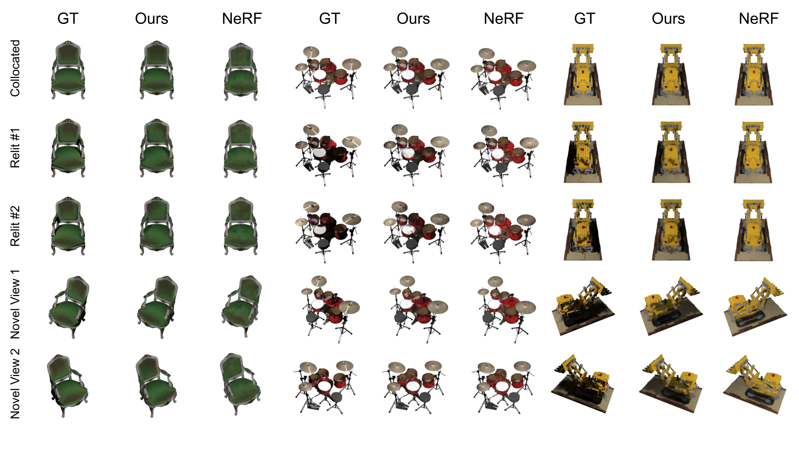

# Neural Ray-tracing

## \[[Paper](https://arxiv.org/abs/2104.13562)\]

Pytorch implementation of Neural Ray-Tracing for reconstructing scenes under known, dynamic
lighting conditions.

## Quickstart

In order to run the code, you can run any of the following commands:
```
make nerv_point

make dtu_diffuse

make dtu_diffuse_lit
```

### Dependencies

- torch 1.8
- tqdm
- numpy
- matplotlib
- imageio

Optional:

- `pytorch_msssim`

# What is Neural Ray-tracing?

Neural Ray-tracing is an extension on top of NeRF & VolSDF to allow for efficient ray-marching,
so that dynamic lighting conditions can be rendered. This is done by adding an additional
network that accounts for lighting based on position and viewing direction, as well as learning
correct surfaces such that an SDF can be quickly raymarched.

This allows for learning known lighting conditions, and then immediate generalization to new
lighting conditions.

## Datasets

Our new collocated light dataset can be found at this [Google
Drive](https://drive.google.com/drive/folders/1-0oZ8OGNR2WDw0R9gbNzt1LpeMaxF_vM?usp=sharing).

In order to get the NeRV dataset, please contact the NeRV authors.

For the DTU dataset, you can run the [script here](data/dtu.sh).

## Results

- Collocated NeRF Dataset



- NeRV


- DTU (Recovery & Relighting)


## Citation

```
@misc{knodt2021neural,
  title={Neural Ray-Tracing: Learning Surfaces and Reflectance for Relighting and View Synthesis},
  author={Julian Knodt and Joe Bartusek and Seung-Hwan Baek and Felix Heide},
  year={2021},
  eprint={2104.13562},
  archivePrefix={arXiv},
  primaryClass={cs.CV}
}
```
