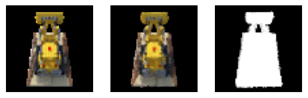
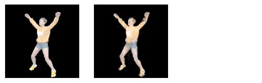
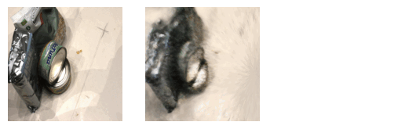
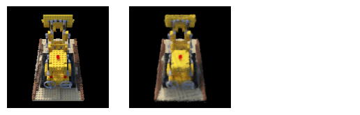

# NeRF Atlas

A repository which contains NeRF and a bunch of extensions to NeRF.


Important Note:
WORK IN PROGRESS, things may be subtly _borken_ 🦮.

---

# What's a NeRF?

Ne(ural) R(adiance) F(ield)s represent a surface by approximating how much light is blocked at
each point in space, and the color of the surface that is blocking it. This approximation can be
used with volumetric rendering to view a surface from new angles.

The original paper implements this idea, and demonstrates its capacity for reconstructing a
surface or scene from a set of views. It has insanely high quality of reconstruction, but takes
forever to train, isn't modifiable at all, and takes a stupid amount of memory. In order to
fix those issues, there are a bunch of different repos which implement single changes to the
original that give it new capabilities, make it train faster, or give it wings, but
no projects mix multiple different modifications. This repo is supposed to be a single
unified interface to many different extensions.  I've implemented a number of other projects,
but there are more. Please feel free to contribute any you would like!

NeRF is similar to projects like [COLMAP](https://demuc.de/colmap/) in that it can perform
surface reconstruction from a series of images, but has not yet been shown to be able to scale
to incredibly large scales while jointly working without prior known camera angles.

The original project is [here](https://www.matthewtancik.com/nerf),
but math to understand why it works is [here](https://pbr-book.org/3ed-2018/Volume_Scattering).

## Usage

```sh
python3 runner.py -h
<All the flags>
```

See makefile for example usages. i.e.
```sh
make dnerf
make dnerfae
make original
```

One note for usage:
- I've found that using large crop-size with small number of batches may lead to better
  training.
- DNeRF is great at reproducing images at training time, but I had trouble getting good test
  results. I noticed that they have an [additional loss](https://github.com/albertpumarola/D-NeRF/issues/1) in their code,
  which isn't mentioned in their paper, but it's not clear to me whether it was used.

## Dependencies

PyTorch, NumPy, tqdm, matplotlib, imageio.

Install them how you want.

Notes on dependency versions:

This library makes use of `tensordot(..., dims=0)`, which is [broken in PyTorch
1.9](https://github.com/pytorch/pytorch/issues/61096). If you find this while using the library,
please downgrade to 1.8

---

## Extensions:

Currently, this repository contains a few extensions on "Plain" NeRF.

Model Level:

- TinyNeRF: One MLP for both density and output spectrum.
- PlainNeRF: Same architecture as original, probably different parameters.
- NeRFAE (NeRF Auto Encoder): Our extension, which encodes every point in space as a vector in a
  latent material space, and derives density and RGB from this latent space. In theory this
  should allow for similar points to be learned more effectively.
- [VolSDF](https://arxiv.org/pdf/2106.12052.pdf) Extends NeRF by volume rendering an SDF.
  This is probably one of the most practical ways to do volume rendering, i.e. seems like the
  most promising method because it merges both volumetric and surface rendering.
- [D-NeRF](https://arxiv.org/abs/2011.13961) for dynamic scenes, using an MLP to encode a
  positional change.
  - Convolutional Update Operator based off of [RAFT's](https://arxiv.org/pdf/2003.12039.pdf).
    Interpolation is definitely not what it's design was intended for, but is more memory
    efficient.
- \[WIP\][Pixel NeRF](https://arxiv.org/pdf/2012.02190.pdf) for single image NeRF
  reconstruction.

Encoding:

- Positional Encoding, as in the original paper.
- [Fourier Features](https://github.com/tancik/fourier-feature-networks).
- Learned Features based on [Siren](https://arxiv.org/abs/2006.09661): Pass low dimensional
  features through an MLP and then use `sin` activations. Not sure if it works.
- [MipNeRF](https://arxiv.org/abs/2103.13415) can be turned on with cylinder or conic volumes.

Training/Efficiency:

- DataParallel can be turned on and off.
- Train on cropped regions of the image for smaller GPUs.
- Neural Upsampling with latent spaces inspired by
  [GIRAFFE](https://arxiv.org/pdf/2011.12100.pdf). The results don't look great, but to be fair
  the paper also has some artifacts.

Note: NeRF is stupid slow. Writing out one of these extensions takes about half an hour,
training it takes about a day, and my GPU is much smaller than any used in the papers.

**Datasets Supported**:

- NeRF Synthetic (`--data-kind original`)
- Dynamic NeRF (`--data-kind dnerf`)
- NeRV (`--data-kind nerv_point`)
- DTU Scans (`--data-kind dtu`)
- NeRFActor (same as NeRF synthetic)

---

### Example outputs



- Collecting datasets for this is difficult. If you have a dataset that you'd like contributed,
  add _a script to download it_ to the `data/` directory!

The outputs I've done are low-res because I'm working off a 3GB gpu and NeRF is memory intensive
during training. That's why I've explored a few different encodings and other tricks to speed it
up.

##### Dynamic NeRF Auto-Encoded



A new change to NeRF using NeRF with an auto-encoder at every point in space. Since we're
mapping to a latent space at every point, it's possible to learn a transformation on that latent
space, for modifying density and visual appearance over time. One downside is that it is much
slower to train because of the higher number of dimensions, and may overfit due to the higher
number of dimensions.

The visualization is on the training set. On the test set it does not perform as well. I suspect
it lacks some regularization for temporal consistency, but I'll continue to look for ways to
make testing better.

##### DTU



##### VolSDF



Implementation of [VolSDF](https://arxiv.org/abs/2106.12052), which produces better quality
output on the low sample counts necessary to run on my machine. It also noticeably has much less
flickering than standard NeRF, because within a region near the surface it is less likely
(guaranteed?) to not have holes unlike standard NeRF.

## Contributing

If you would like to contribute, feel free to submit a PR, but I may be somewhat strict,
apologies in advance.

Please maintain the same style:
- 2 spaces, no tabs
- Concise but expressive names
- Default arguments and type annotations when possible.
- Single line comments for functions, intended for developers.

#### Full options

The full set of options for training as of #416d073ed91573f36450ada1439d681227d8045e are below:

```
usage: runner.py [-h] -d DATA
optional arguments:
  -h, --help            show this help message and exit
  -d DATA, --data DATA  path to data (default: None)
  --data-kind {original,single_video,dnerf,dtu,pixel-single,nerv_point,shiny}
                        Kind of data to load (default: original)
  --derive-kind         Attempt to derive the kind if a single file is given
                        (default: True)
  --outdir OUTDIR       path to output directory (default: outputs/)
  --timed-outdir        Create new output directory with date and time of run
                        (default: False)
  --size SIZE           post-upsampling size (default: 32)
  --render-size RENDER_SIZE
                        pre-upsampling size (default: 16)
  --epochs EPOCHS       number of epochs to train for (default: 30000)
  --batch-size BATCH_SIZE
                        # views for each training batch (default: 8)
  --neural-upsample     add neural upsampling (default: False)
  --crop                train with cropping (default: False)
  --crop-size CROP_SIZE
                        what size to use while cropping (default: 16)
  --steps STEPS         Number of depth steps (default: 64)
  --mip {cone,cylinder}
                        Use MipNeRF with different sampling (default: None)
  --sigmoid-kind {normal,thin,tanh,fat,cyclic,upshifted,softmax,leaky_relu,sin,upshifted_softplus}
                        What sigmoid to use, curr keeps old (default: thin)
  --backing-sdf         Use a backing SDF (default: False)
  --feature-space FEATURE_SPACE
                        when using neural upsampling, what is the feature
                        space size (default: 32)
  --model {tiny,plain,ae,volsdf,sdf}
                        which model do we want to use (default: plain)
  --bg {black,white,mlp,noise}
                        What kind of background to use for NeRF (default:
                        black)
  -lr LEARNING_RATE, --learning-rate LEARNING_RATE
                        learning rate (default: 0.0005)
  --seed SEED           Random seed to use, -1 is no seed (default: 1337)
  --decay DECAY         Weight decay value (default: 0)
  --notest              Do not run test set (default: False)
  --data-parallel       Use data parallel for the model (default: False)
  --omit-bg             Omit black bg with some probability (default: False)
  --train-parts {all,refl,occ,[TODO]Camera} [{all,refl,occ,[TODO]Camera} ...]
                        Which parts of the model should be trained (default:
                        ['all'])
  --loss-fns {l1,l2,rmse} [{l1,l2,rmse} ...]
                        Loss functions to use (default: ['l2'])
  --color-spaces {rgb,hsv,luminance,xyz} [{rgb,hsv,luminance,xyz} ...]
                        Color spaces to compare on (default: ['rgb'])
  --tone-map            Add tone mapping (1/(1+x)) before loss function
                        (default: False)
  --nerv-multi-point    Use NeRV multi point light dataset for testing
                        (default: False)
  --style-img STYLE_IMG
                        Image to use for style transfer (default: None)
  --no-sched            Do not use a scheduler (default: False)
  --serial-idxs         Train on images in serial (default: False)
  --mpi                 [WIP] Use multi-plain imaging (default: False)
  --replace [{refl,occ,bg,sigmoid,light} [{refl,occ,bg,sigmoid,light} ...]]
                        Modules to replace on this run, if any. Take caution
                        for overwriting existing parts. (default: [])
  --volsdf-direct-to-path
                        Convert an existing direct volsdf model to a path
                        tracing model (default: False)
  --volsdf-alternate    Use alternating volume rendering/SDF training volsdf
                        (default: False)
  --latent-size LATENT_SIZE
                        Latent-size to use in shape models. If not supported
                        by the shape model, it will be ignored. (default: 32)
  --refl-order REFL_ORDER
                        Order for classical Spherical Harmonics & Fourier
                        Basis BSDFs/Reflectance models (default: 2)
  --inc-fourier-freqs   Multiplicatively increase the fourier frequency
                        standard deviation on each run (default: False)

reflectance:
  --refl-kind {pos,view,basic,diffuse,rusin,sph-har,fourier,weighted}
                        What kind of reflectance model to use (default:
                        ['view'])
  --weighted-subrefl-kinds {pos,view,basic,diffuse,rusin,sph-har,fourier} [{pos,view,basic,diffuse,rusin,sph-har,fourier} ...]
                        What subreflectances should be used with --refl-kind
                        weighted. They will not take a spacial component, and
                        only rely on view direction, normal, and light
                        direction. (default: ['rusin', 'rusin', 'rusin',
                        'rusin'])
  --normal-kind {None,elaz,raw}
                        How to include normals in reflectance model. Not all
                        surface models support normals (default: None)
  --space-kind {identity,surface,none}
                        Space to encode texture: surface builds a map from 3D
                        (identity) to 2D (default: identity)
  --alt-train {analytic,learned}
                        Whether to train the analytic or the learned model in
                        this session (default: learned)
  --refl-bidirectional  Allow normals to be flipped for the reflectance (just
                        Diffuse for now) (default: False)

integrator:
  --integrator-kind {None,direct,path}
                        Integrator to use for surface rendering (default:
                        None)
  --occ-kind {None,hard,learned,all-learned}
                        Occlusion method for shadows to use in integration
                        (default: None)
  --smooth-occ SMOOTH_OCC
                        Weight to smooth occlusion/shadows by. (default: 0)

light:
  --light-kind {field,point,dataset,None}
                        Kind of light to use while rendering. Dataset
                        indicates light is in dataset (default: None)
  --light-intensity LIGHT_INTENSITY
                        Intensity of light to use with loaded dataset
                        (default: 100)

sdf:
  --sdf-eikonal SDF_EIKONAL
                        Weight of SDF eikonal loss (default: 0)
  --smooth-normals SMOOTH_NORMALS
                        Amount to attempt to smooth normals (default: 0)
  --smooth-surface SMOOTH_SURFACE
                        Amount to attempt to smooth surface normals (default:
                        0)
  --smooth-eps SMOOTH_EPS
                        size of random uniform perturbation for smooth normals
                        regularization (default: 0.001)
  --smooth-eps-rng      smooth by a random amount instead of smoothing by a
                        fixed distance (default: False)
  --smooth-n-ord {1,2} [{1,2} ...]
                        Order of vector to use when smoothing normals
                        (default: [2])
  --sdf-kind {spheres,siren,local,mlp,triangles}
                        Which SDF model to use (default: mlp)
  --sphere-init         Initialize SDF to a sphere (default: False)
  --bound-sphere-rad BOUND_SPHERE_RAD
                        Intersect the learned SDF with a bounding sphere at
                        the origin, < 0 is no sphere (default: -1)
  --sdf-isect-kind {sphere,secant,bisect}
                        Marching kind to use when computing SDF intersection.
                        (default: bisect)
  --volsdf-scale-decay VOLSDF_SCALE_DECAY
                        Decay weight for volsdf scale (default: 0)

dnerf:
  --dnerfae             Use DNeRFAE on top of DNeRF (default: False)
  --dnerf-tf-smooth-weight DNERF_TF_SMOOTH_WEIGHT
                        L2 smooth dnerf tf (default: 0)
  --time-gamma          Apply a gamma based on time (default: False)
  --gru-flow            Use GRU for Δx (default: False)
  --with-canon WITH_CANON
                        Preload a canonical NeRF (default: None)
  --fix-canon           Do not train canonical NeRF (default: False)

camera parameters:
  --near NEAR           near plane for camera (default: 2)
  --far FAR             far plane for camera (default: 6)

reporting parameters:
  --name NAME           Display name for convenience in log file (default: )
  -q, --quiet           Silence tqdm (default: False)
  --save SAVE           Where to save the model (default: models/model.pt)
  --log LOG             Where to save log of arguments (default: log.json)
  --save-freq SAVE_FREQ
                        # of epochs between saves (default: 5000)
  --valid-freq VALID_FREQ
                        how often validation images are generated (default:
                        500)
  --display-smoothness  Display smoothness regularization (default: False)
  --nosave              do not save (default: False)
  --load LOAD           model to load from (default: None)
  --loss-window LOSS_WINDOW
                        # epochs to smooth loss over (default: 250)
  --notraintest         Do not test on training set (default: False)
  --duration-sec DURATION_SEC
                        Max number of seconds to run this for, s <= 0 implies
                        None (default: 0)
  --param-file PARAM_FILE
                        Path to JSON file to use for hyper-parameters
                        (default: None)
  --skip-loss SKIP_LOSS
                        Number of epochs to skip reporting loss for (default:
                        0)
  --msssim-loss         Report ms-ssim loss during testing (default: False)
  --depth-images        Whether to render depth images (default: False)
  --normals-from-depth  Render extra normal images from depth (default: False)
  --depth-query-normal  Render extra normal images from depth (default: False)
  --not-magma           Do not use magma for depth maps (instead use default)
                        (default: False)

meta runner parameters:
  --torchjit            Use torch jit for model (default: False)
  --train-imgs TRAIN_IMGS
                        # training examples (default: -1)
  --draw-colormap       Draw a colormap for each view (default: False)
  --convert-analytic-to-alt
                        Combine a model with an analytic BRDF with a learned
                        BRDF for alternating optimization (default: False)
  --clip-gradients CLIP_GRADIENTS
                        If > 0, clip gradients (default: 0)

auto encoder parameters:
  --latent-l2-weight LATENT_L2_WEIGHT
                        L2 regularize latent codes (default: 0)
  --normalize-latent    L2 normalize latent space (default: False)
  --encoding-size ENCODING_SIZE
                        Intermediate encoding size for AE (default: 32)
```
